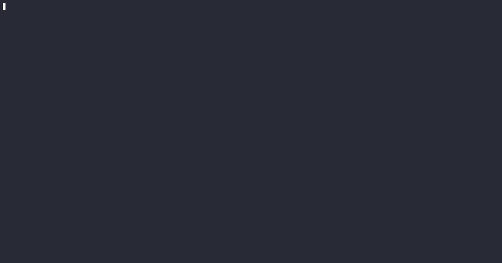

# gpm - A package manager in and for Go

[](https://www.facebook.com/sharer/sharer.php?u=https%3A%2F%2Fgithub.com%2Fmkloubert%2Fgo-package-manager&quote=gpm%20-%20Go%20Package%20Manager) [](https://x.com/intent/tweet?source=https%3A%2F%2Fgithub.com%2Fmkloubert%2Fgo-package-manager&text=gpm%20-%20Go%20Package%20Manager) [](https://pinterest.com/pin/create/button/?url=https%3A%2F%2Fgithub.com%2Fmkloubert%2Fgo-package-manager&description=gpm%20-%20Go%20Package%20Manager) [](https://www.reddit.com/submit?url=https%3A%2F%2Fgithub.com%2Fmkloubert%2Fgo-package-manager&title=gpm%20-%20Go%20Package%20Manager) [](https://www.linkedin.com/shareArticle?mini=true&url=https%3A%2F%2Fgithub.com%2Fmkloubert%2Fgo-package-manager&title=gpm%20-%20Go%20Package%20Manager) [](https://wordpress.com/press-this.php?u=https%3A%2F%2Fgithub.com%2Fmkloubert%2Fgo-package-manager&s=gpm%20-%20Go%20Package%20Manager) [](mailto:?subject=gpm%20-%20Go%20Package%20Manager&body=https%3A%2F%2Fgithub.com%2Fmkloubert%2Fgo-package-manager)

## Table of contents

- [Overview](#overview-)
- [Installation](#installation-)
  - [Linux / UNIX](#linux--unix-)
  - [MacOS](#macos-)
  - [Windows](#windows-)
  - [Build from source](#build-from-source-)
- [Usage](#usage-)
  - [Commands](#commands-)
    - [Add alias](#add-alias-)
    - [Add project](#add-project-)
    - [AI chat](#ai-chat-)
    - [AI prompt](#ai-prompt-)
    - [Audit dependencies](#audit-dependencies-)
    - [Build and install executable](#build-and-install-executable-)
    - [Build project](#build-project-)
    - [Bump version](#bump-version-)
    - [Checkout branch](#checkout-branch-)
      - [Branch aliases](#branch-aliases-)
    - [Cleanup project](#cleanup-project-)
    - [Compare code changes](#compare-code-changes-)
    - [Docker shorthands](#docker-shorthands-)
    - [Execute shell command](#execute-shell-command-)
    - [Import aliases](#import-aliases-)
    - [Import projects](#import-projects-)
    - [Install dependencies](#install-dependencies-)
    - [List aliases](#list-aliases-)
    - [List executables](#list-executables-)
    - [List projects](#list-projects-)
    - [Monitor process](#monitor-process-)
    - [New project](#new-project-)
    - [Open alias](#open-alias-)
    - [Open project](#open-project-)
    - [Pack project](#pack-project-)
    - [Pull from Git remotes](#pull-from-git-remotes-)
    - [Push to Git remotes](#push-to-git-remotes-)
    - [Remove alias](#remove-alias-)
    - [Remove project](#remove-project-)
    - [Remove executable](#remove-project-executable-)
    - [Run script](#run-script-)
    - [Run tests](#run-tests-)
    - [Show dependency graph](#show-dependency-graph-)
    - [Start project](#start-project-)
    - [Synchronize with Git remotes](#synchronize-with-git-remotes-)
    - [Uninstall dependencies](#uninstall-dependencies-)
  - [Setup AI](#setup-ai-)
    - [OpenAI / ChatGPT](#openai--chatgpt-)
    - [Ollama](#ollama-)
- [gpm.yaml](#gpmyaml-)
  - [Files](#files-)
  - [Scripts](#scripts-)
    - [Predefined](#predefined-)
- [Environment variables](#environment-variables-)
  - [Supported variables](#supported-variables-)
- [Contribution](#contribution-)
- [Support](#support-)
- [License](#license-)
- [Credits](#credits-)

## Overview [<a href="#table-of-contents">↑</a>]

`gpm` is a command-line tool designed to simplify developer workflows in particular for Go projects.

However, it's not only limited to Go but can also be utilized for other project types as well.

**KEEP IN MIND**: This project is in an beta state and under heavy development. It might happen that there will be breaking changes. Have a look at the [CHANGELOG.md file](CHANGELOG.md).

## Installation [<a href="#table-of-contents">↑</a>]

You can install `gpm` from a [pre-build binary](https://github.com/mkloubert/go-package-manager/releases) or build it by your own:

### Linux / UNIX [<a href="#installation-">↑</a>]

The following [curl operation(s)](https://curl.se/) will download the latest version [from GitHub](https://github.com/mkloubert/go-package-manager/releases) and extract it to `/usr/local/bin` as `gpm` executable, which should be part of the `$PATH` environment variable (this also requires [jq tool](https://github.com/jqlang/jq)):

```bash
# replace "<!!!OS!!!>" with one of the following values:
# - "openbsd"
# - "linux"
# - "freebsd"
#
# replace "<!!!CPU!!!>" with one of the following values:
# - "386": Intel compatible (32-bit)
# - "amd64": Intel compatible (64-bit)
# - "arm": ARM (32-bit)
# - "arm64": ARM (64-bit)
curl -s https://api.github.com/repos/mkloubert/go-package-manager/releases/latest | jq -r '.assets[].browser_download_url | select(contains("<!!!OS!!!>") and contains("<!!!CPU!!!>") and (. | tostring | contains("sha256") | not))' | xargs curl -sL | tar xzOf - gpm | sudo tee /usr/local/bin/gpm > /dev/null && sudo chmod +x /usr/local/bin/gpm
```

Later, you can also execute the following command, which will install a script named `gpm-update` in `$HOME/.gpm/bin` folder:

```bash
gpm setup updater
```

### MacOS [<a href="#installation-">↑</a>]

The following [curl operation(s)](https://formulae.brew.sh/formula/curl) will download the latest version [from GitHub](https://github.com/mkloubert/go-package-manager/releases) and extract it to `/usr/local/bin` as `gpm` executable, which should be part of the `$PATH` environment variable (this also requires [jq tool](https://formulae.brew.sh/formula/jq)):

```bash
# Apple Silicon
curl -s https://api.github.com/repos/mkloubert/go-package-manager/releases/latest | jq -r '.assets[].browser_download_url | select(contains("darwin") and contains("arm64") and (. | tostring | contains("sha256") | not))' | xargs curl -sL | tar xzOf - gpm | sudo tee /usr/local/bin/gpm > /dev/null && sudo chmod +x /usr/local/bin/gpm

# use the following commands if you use a legacy Intel 64-bit system
# curl -s https://api.github.com/repos/mkloubert/go-package-manager/releases/latest | jq -r '.assets[].browser_download_url | select(contains("darwin") and contains("amd64") and (. | tostring | contains("sha256") | not))' | xargs curl -sL | tar xzOf - gpm | sudo tee /usr/local/bin/gpm > /dev/null && sudo chmod +x /usr/local/bin/gpm
```

Later, you can also execute the following command, which will install a script named `gpm-update` in `$HOME/.gpm/bin` folder:

```bash
gpm setup updater
```

### Windows [<a href="#installation-">↑</a>]

will download the latest version [from GitHub](https://github.com/mkloubert/go-package-manager/releases) and extract it to `C:\Program Files\gpm` as `gpm.exe` executable, which should be made part of the `PATH` environment variable:

```powershell
# replace "<!!!CPU!!!>" with one of the following values:
# - "386": Intel compatible (32-bit)
# - "amd64": Intel compatible (64-bit)
# - "arm": ARM (32-bit)
Invoke-WebRequest 'https://api.github.com/repos/mkloubert/go-package-manager/releases/latest' -UseBasicParsing | ConvertFrom-Json | % { $_.assets | Where-Object { $_.browser_download_url -like '*windows*<!!!CPU!!!>*.zip' -and $_.browser_download_url -notlike '*sha256*' } | Select-Object -ExpandProperty browser_download_url -First 1 } | % { $url=$_; $output="gpm.zip"; Invoke-WebRequest $url -OutFile $output; Expand-Archive $output -DestinationPath "$env:TEMP\gpm" -Force; New-Item -ItemType Directory -Path "C:\Program Files\gpm" -Force | Out-Null; Copy-Item "$env:TEMP\gpm\gpm.exe" -Destination "C:\Program Files\gpm" }
```

### Build from source [<a href="#installation-">↑</a>]

```bash
# checkout current source
git clone https://github.com/mkloubert/go-package-manager.git -o gpm

# switch to new subfolder, build and run it
cd gpm
go build . && ./gpm --version
```

## Usage [<a href="#table-of-contents">↑</a>]

### Commands [<a href="#usage-">↑</a>]

#### Add alias [<a href="#commands-">↑</a>]

With

```bash
gpm add alias yaml https://github.com/go-yaml/yaml
```

you define the alias `yaml` which refers to the Git repository in `https://github.com/go-yaml/yaml`. This information will be stored in `aliases.yaml` file inside your `$HOME/.gpm` folder.

If you later run

```bash
gpm install yaml
```

`go get -u https://github.com/go-yaml/yaml` will be executed instead.

#### Add project [<a href="#commands-">↑</a>]

With

```bash
gpm add project react-project https://github.com/ofnullable/react-spa-template
```

you define the alias `react-project` which refers to the Git repository in `https://github.com/ofnullable/react-spa-template`. This information will be stored in `projects.yaml` file inside your `$HOME/.gpm` folder.

If you later run

```bash
gpm new react-project
```

the repository will be cloned to `react-spa-template` subfolder, then its `.git` folder will be removed and the new folder will be re-initialized with `git init`.

#### AI chat [<a href="#commands-">↑</a>]



#### AI prompt [<a href="#commands-">↑</a>]


#### Audit dependencies [<a href="#commands-">↑</a>]


#### Build and install executable [<a href="#commands-">↑</a>]

```bash
gpm make https://github.com/gohugoio/hugo
```

will clone the repository into a temp folder and run `gpm build` from it.

The final executable will be installed in `$HOME/.gpm/bin` folder. So it could be useful to add it to the `$PATH` enviornment variable.

FYI: Instead of the URL as argument you can use a project alias added by [add project command](#add-project-).

#### Build project [<a href="#commands-">↑</a>]

```bash
gpm build
```

will run `go build .` in the current directory or the `build` script in [gpm.yaml](#gpmyaml-), if defined.

#### Bump version [<a href="#commands-">↑</a>]

The simple execution of

```bash
gpm bump version
```

will detect the latest version of the underlying repository from [Git tags](https://git-scm.com/book/en/v2/Git-Basics-Tagging) and then upgrade the minor part only, e.g. `1.2.4` => `1.3.4`. Finally a new Git tag is created in the format `v1.3.4`.

You also can use at least one of the following flags to increase parts of the current version number as well:

- `--breaking`: `1.2.4` => `2.0.0` by default
- `--feature`: `1.2.4` => `1.3.0` by default
- `--fix`: `1.2.4` => `1.2.5`

#### Checkout branch [<a href="#commands-">↑</a>]

The execution of

```bash
gpm checkout my-branch
```

will checkout or create the branch `my-branch` in the current Git repository.

If the branch does not exist, you can use `--suggest` to use AI which generates a branch name from a description using format `<type>/<description>`.

An execution of

```bash
gpm checkout "i will fix the save button on start page" --suggest
```

for example could suggest a value like `feature/fix-save-button-on-start-page` when using ChatGPT 3.5

Have a look at the [Setup AI](#setup-ai) which describes how to setup OpenAI or Ollama API.

##### Branch aliases [<a href="#checkout-branch-">↑</a>]

For example, if you define the environment variable `GPM_BRANCH_DEV` with `development` as value, you can run

```bash
gpm checkout :dev
```

from the command line to switch to `development` branch.

The `:dev` is the part after the `GPM_BRANCH_` prefix in the environment variable name.

This means you are also able to define a variable, lets say `GPM_BRANCH_FOO`, with the value `bar`, which will allow you to easily switch to `bar` branch if you execute

```
gpm checkout :foo
```

Keep in mind: If you have no value for an alias defined, `gpm` will take its name as fallback!

#### Cleanup project [<a href="#commands-">↑</a>]

```bash
gpm tidy
```

is a short form of `go mod tidy`.

#### Compare code changes [<a href="#commands-">↑</a>]


#### Docker shorthands [<a href="#commands-">↑</a>]

| Shorthand  | Final command               |
| ---------- | --------------------------- |
| `gpm down` | `docker compose down`       |
| `gpm up`   | `docker compose up --build` |

#### Execute shell command [<a href="#commands-">↑</a>]

For example

```bash
gpm execute go version
```

will run `go version` with the settings and environment variables loaded from [.env\* files](#environment-variables-).

#### Import aliases [<a href="#commands-">↑</a>]

```bash
gpm import aliases https://raw.githubusercontent.com/mkloubert/go-package-manager/main/aliases.yaml
```

loads aliases from `https://raw.githubusercontent.com/mkloubert/go-package-manager/main/aliases.yaml` and merge them with entries in `aliases.yaml` file in `$HOME/.gpm` folder.

You can also use a local file path and/or pipe from `STDIN` as well.

#### Import projects [<a href="#commands-">↑</a>]

```bash
gpm import projects https://raw.githubusercontent.com/mkloubert/go-package-manager/main/projects.yaml
```

loads projects from `https://raw.githubusercontent.com/mkloubert/go-package-manager/main/projects.yaml` and merge them with entries in `projects.yaml` file in `$HOME/.gpm` folder.

You can also use a local file path and/or pipe from `STDIN` as well.

#### Install dependencies [<a href="#commands-">↑</a>]

`gpm install <alias>` is designed to install a module via an alias defined with [Add alias](#add-alias-) command.

For example if you define an alias called `yaml` with

```bash
gpm add alias yaml https://github.com/go-yaml/yaml
```

you can run

```bash
gpm install yaml
```

later which will simply call `go get -u https://github.com/go-yaml/yaml` instead.

#### List aliases [<a href="#commands-">↑</a>]

Simply run

```bash
gpm list aliases
```

will output a list like this:

```
cobra
        https://github.com/spf13/cobra
mongo
        go.mongodb.org/mongo-driver/mongo
yaml
        https://github.com/go-yaml/yaml
```

#### List executables [<a href="#commands-">↑</a>]

Executables / binaries created with [make command](#build-and-install-executable-) can be listed with

```bash
gpm list binaries
```

#### List projects [<a href="#commands-">↑</a>]

Simply run

```bash
gpm list projects
```

will output a list like this:

```
mkloubert
        git@github.com:mkloubert/mkloubert.git
```

#### Monitor process [<a href="#commands-">↑</a>]


#### New project [<a href="#commands-">↑</a>]

`gpm new <project>` is designed to setup a project via an alias defined with [Add project](#add-project-) command.

For example if you define an alias called `mkloubert` with

```bash
gpm add project mkloubert git@github.com:mkloubert/mkloubert.git
```

you can run

```bash
gpm new mkloubert
```

later which will simply call `git clone git@github.com:mkloubert/mkloubert.git` instead that clones the Git repository to `mkloubert` subfolder, removes its `.git` folder and re-initializes it with `git init`.

#### Open alias [<a href="#commands-">↑</a>]

Aliases created by [Add alias command](#add-alias-) can be opened by default handler of the operating system.

Lets say you created an alias called `cobra` with the URL `https://github.com/spf13/cobra`, the execution of

```bash
gpm open alias cobra
```

will open this URL usually in the browser.

#### Open project [<a href="#commands-">↑</a>]

Project entries created by [Add project command](#add-project-) can be opened by default handler of the operating system.

Lets say you created a project alias called `gpm` with the URL `https://github.com/mkloubert/go-package-manager`, the execution of

```bash
gpm open project cobra
```

will open this URL usually in the browser.

#### Pack project [<a href="#commands-">↑</a>]


#### Pull from Git remotes [<a href="#commands-">↑</a>]

The execution of

```bash
gpm pull
```

will pull from all remotes which are stored inside the current Git repository.

#### Push to Git remotes [<a href="#commands-">↑</a>]

The execution of

```bash
gpm push
```

will push to all remotes which are stored inside the current Git repository.

#### Remove alias [<a href="#commands-">↑</a>]

With

```bash
gpm remove alias yaml
```

you will remove the `yaml` alias from `aliases.yaml` file, which is stored in `$HOME/.gpm` folder.

#### Remove project [<a href="#commands-">↑</a>]

With

```bash
gpm remove project yaml
```

you will remove the `yaml` alias from `projects.yaml` file, which is stored in `$HOME/.gpm` folder.

#### Remove executable [<a href="#commands-">↑</a>]

If you installed a binary with [make command](#build-and-install-executable-) like

```bash
gpm make https://github.com/gopasspw/gopass
```

you can simply remove it with `gpm remove binary gopass` if the binary is stored as `gopass` in `$HOME/.gpm/bin` folder.

#### Run script [<a href="#commands-">↑</a>]

In the [gpm.yaml file](#gpmyaml-) you can define script which are executed in shell/terminal context:

```yaml
scripts:
  foo: "echo bar"
```

With

```bash
gpm run foo
```

you will run `echo bar`.

#### Run tests [<a href="#commands-">↑</a>]

```bash
gpm test
```

will execute `go test .` instead or the `test` script defined in current [gpm.yaml file](#gpmyaml-), if defined.

#### Show dependency graph [<a href="#commands-">↑</a>]

Running

```bash
gpm show dependencies
```

will create and open a temporary HTML file which will display a dependency graph of all installed modules:


#### Start project [<a href="#commands-">↑</a>]

```bash
gpm start
```

will execute `go run .` instead or the `start` script defined in current [gpm.yaml file](#gpmyaml-), if defined.

#### Synchronize with Git remotes [<a href="#commands-">↑</a>]

With execution of

```bash
gpm sync
```

you will [pull from](#pull-from-git-remotes-) and then [push to](#push-to-git-remotes-) all remotes as defined in the current Git repository.

#### Uninstall dependencies [<a href="#commands-">↑</a>]

`gpm uninstall <alias>` is designed to un-install a module via an alias defined with [Add alias](#add-alias-) command.

For example if you define an alias called `yaml` with

```bash
gpm add alias yaml https://github.com/go-yaml/yaml
```

you can run

```bash
gpm uninstall yaml
```

later which will simply call `go get -u https://github.com/go-yaml/yaml@none` instead.

## Setup AI [<a href="#table-of-contents">↑</a>]

If you would like to use AI feature, like suggestion of branch names, you can setup one of the following APIs:

### OpenAI / ChatGPT [<a href="#setup-ai-">↑</a>]

Create (or use) an API from https://platform.openai.com/api-keys and write it to `OPENAI_API_KEY` environment variable.

By default `gpt-3.5-turbo` model is used. You can change this, by setting up `GPM_AI_CHAT_MODEL` environment variable with a [value from here](https://platform.openai.com/docs/models) like this:

```dotenv
GPM_AI_CHAT_MODEL=gpt-4-turbo
```

### Ollama [<a href="#setup-ai-">↑</a>]

If you want to use [Ollama](https://ollama.com/) instead, you have to setup the following environment variables:

```dotenv
GPM_AI_API=ollama
GPM_AI_CHAT_MODEL=<name of the model>
```

Replace `<name of the model>` with [one of these models](https://ollama.com/library).

Two good models are [llama3 by Meta](https://ollama.com/library/llama3) or [phi3 by Microsoft](https://ollama.com/library/phi3).

## gpm.yaml [<a href="#table-of-contents">↑</a>]

The idea of an `gpm.yaml` file is very similar to `package.json` file for Node / NPM environments.

An [example can be found here](./gpm.yaml).

If you want to initialize an empty one, you only need to execute

```bash
gpm init
```

in your terminal.

### Files [<a href="#gpmyaml-">↑</a>]

The `files` section contains a list of regular expressions of files which is used by [pack command](#pack-project-):

```yaml
# ...

files:
  - my-app
  - LICENSE
  - README.md
  - ^commands/p
# ...
```

If the list is empty or not defined, the following default values are set:

- possible name of the executable file build with [build command](#build-project-)
- `^CHANGELOG.md$`
- `^CONTRIBUTING.md$`
- `^CONTRIBUTION.md$`
- `^LICENSE$`
- `^README.md$`

### Scripts [<a href="#gpmyaml-">↑</a>]

Create or update the `scripts` section with key/value pairs:

```yaml
scripts:
  test1: "echo Test1"
  test2: "echo Test2"
```

From the project folder you will be able to execute `gpm run test1` or `gpm run test2` to run the defined shell/terminal commands.

#### Predefined [<a href="#scripts-">↑</a>]

| Name          | Description                                                                                 |
| ------------- | ------------------------------------------------------------------------------------------- |
| `postbuild`   | Is executed after successful execution of [build command](#build-project-).                 |
| `postinstall` | Is executed after successful execution of [install command](#install-dependencies-).        |
| `posttest`    | Is executed after successful execution of [test command](#run-tests-).                      |
| `prebuild`    | Is executed before [build command](#build-project-) is executed.                            |
| `preinstall`  | Is executed before [install command](#install-dependencies-) is executed.                   |
| `pretest`     | Is executed before [test command](#run-tests-) is executed.                                 |
| `start`       | Is executed by [start command](#start-project-). If not defined `go run .` is executed.     |
| `test`        | Is executed by [test command](#run-tests-). If not defined `go test .` is executed.         |
| `tidy`        | Is executed by [tidy command](#cleanup-project-). If not defined `go mod tidy` is executed. |

## Environment variables [<a href="#table-of-contents">↑</a>]

Environment variables can be loaded from external files, which are handled in this order:

- `$HOME/.gpm/.env<SUFFIX>` (if exist)
- `<PROJECT-DIR>/.env` (if exist)
- `<PROJECT-DIR>/.env<SUFFIX>` (if exist)
- `<PROJECT-DIR>/.env.local` (if exist)
- `<PROJECT-DIR>/.env<SUFFIX>.local` (if exist)
- from `--env-file` flags (must exist!)

`<SUFFIX>` is the lower case value from `--environment` and can be empty.

### Supported variables [<a href="#environment-variables-">↑</a>]

| Name                      | Description                                                                                                                                                    | Example                                                                      |
| ------------------------- | -------------------------------------------------------------------------------------------------------------------------------------------------------------- | ---------------------------------------------------------------------------- |
| `GPM_AI_API`              | ID of the AI API to use. Possible values are `ollama` or `openai`.                                                                                             | `openai`                                                                     |
| `GPM_AI_CHAT_MODEL`       | ID of the AI chat model to use. Possible values are models by [OpenAI](https://platform.openai.com/docs/models) or [Ollama](https://ollama.com/library).       | `gpt-4o`                                                                     |
| `GPM_AI_CHAT_TEMPERATURE` | Temperature value for an AI chat (operation)                                                                                                                   | `0`                                                                          |
| `GPM_AI_PROMPT`           | Custom prompt for operations which are using chat completion operations, like [checkout command](#build-project-).                                             |                                                                              |
| `GPM_AI_SYSTEM_PROMPT`    | Custom (initial) system prompt for AI chat operations.                                                                                                         | `You are a helpful AI assistant. You always answer in a very sarcastic way.` |
| `GPM_BIN_PATH`            | Custom folder for binaries installed by [make command](#build-and-install-executable-). Default is `$HOME/.gpm/bin`.                                           | `/my/custom/bin/path`                                                        |
| `GPM_DOWN_COMMAND`        | Custom command for [docker compose down](#docker-shorthands-) shorthand.                                                                                       | `docker-compose down`                                                        |
| `GPM_ENV`                 | ID of the current environment. This is especially used for the [.env files](#environment-variables-).                                                          | `prod`                                                                       |
| `GPM_INSTALL_PATH`        | Custom installation path of global `gpm` binary.                                                                                                               | `/usr/bin`                                                                   |
| `GPM_TERMINAL_FORMATTER`  | Default formatter for syntax highlighting in terminal. See [chroma project](https://github.com/alecthomas/chroma/tree/master/formatters) for more information. | `terminal16m`                                                                |
| `GPM_TERMINAL_STYLE`      | Default style for syntax highlighting in terminal. See [chroma project](https://github.com/alecthomas/chroma/tree/master/styles) for more information.         | `monokai`                                                                    |
| `GPM_UP_COMMAND`          | Custom command for [docker compose up](#docker-shorthands-) shorthand.                                                                                         | `docker-compose up`                                                          |
| `OPENAI_API_KEY`          | Key which is used for the [API by OpenAI](https://platform.openai.com/docs/api-reference).                                                                     | `sk-...`                                                                     |

## Contribution [<a href="#table-of-contents">↑</a>]

If you have ideas and/or want to participate you are welcome!

[Open an issue](https://github.com/mkloubert/go-package-manager/issues/new) or [create a pull request](https://github.com/mkloubert/go-package-manager/compare).

## Support [<a href="#table-of-contents">↑</a>]

If you like the project you can [donate via PayPal](https://paypal.me/MarcelKloubert).

## License [<a href="#table-of-contents">↑</a>]

The project is licensed under the [MIT](./LICENSE).

## Credits [<a href="#table-of-contents">↑</a>]

`gpm` makes use of these following great projects:

- [asciinema](https://github.com/asciinema/asciinema) + [agg](https://github.com/asciinema/agg) by [asciinema team](https://github.com/asciinema)
- [Babel.js](https://babeljs.io) by [Babel team](https://opencollective.com/babel)
- [chroma](https://github.com/alecthomas/chroma) by [Alec Thomas](https://github.com/sponsors/alecthomas)
- [cobra](https://github.com/spf13/cobra) by [Steve Francia](https://github.com/spf13)
- [go-prompt](https://github.com/c-bata/go-prompt) by [c-bata](https://github.com/sponsors/c-bata)
- [go-version](https://github.com/hashicorp/go-version) by [HashiCorp](https://github.com/hashicorp)
- [go-yaml](https://github.com/goccy/go-yaml) by [Masaaki Goshima](https://github.com/sponsors/goccy)
- [godotenv](https://github.com/joho/godotenv) by [John Barton](https://github.com/joho)
- [gopsutil](https://github.com/shirou/gopsutil) by [shirou](https://github.com/sponsors/shirou)
- [Mermaid](https://github.com/mermaid-js/mermaid) by [Knut Sveidqvist](https://github.com/knsv) and [Sidharth Vinod](https://github.com/sidharthv96)
- [progressbar](https://github.com/schollz/progressbar) by [Zack](https://github.com/sponsors/schollz)
- [React](https://react.dev)
- [spinner](https://github.com/sponsors/briandowns) by [Brian Downs](https://github.com/sponsors/briandowns)
- [termui](https://github.com/gizak/termui) by [Zack Guo](https://github.com/gizak)
