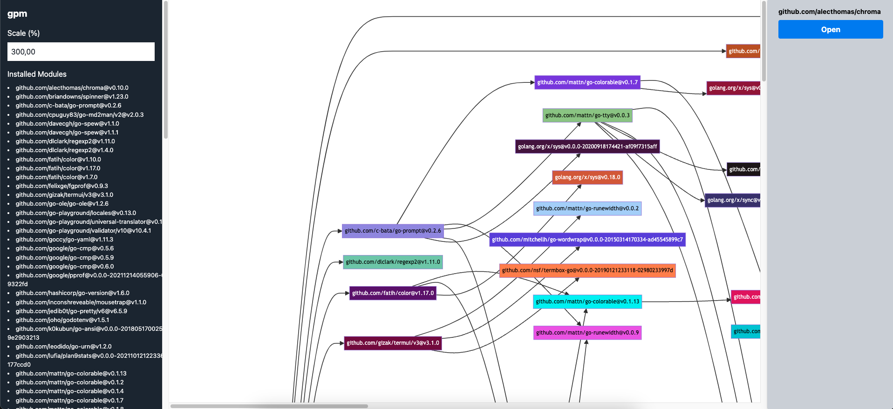

# gpm - A swiss army knife written in and for Go

<p align="center">
  
</p>

<p align="center">
  Copyright by <a href="https://marcel.coffee" target="_blank">Marcel Joachim Kloubert</a>, created with <a href="https://www.midjourney.com/" target="_blank">Midjourney</a>
</p>

[](https://pkg.go.dev/github.com/mkloubert/go-package-manager) [](https://goreportcard.com/report/github.com/mkloubert/go-package-manager)

[](https://pinterest.com/pin/create/button/?url=https%3A%2F%2Fgithub.com%2Fmkloubert%2Fgo-package-manager&description=gpm%20-%20Go%20Package%20Manager) [](https://www.reddit.com/submit?url=https%3A%2F%2Fgithub.com%2Fmkloubert%2Fgo-package-manager&title=gpm%20-%20Go%20Package%20Manager) [](https://www.linkedin.com/shareArticle?mini=true&url=https%3A%2F%2Fgithub.com%2Fmkloubert%2Fgo-package-manager&title=gpm%20-%20Go%20Package%20Manager) [](https://wordpress.com/press-this.php?u=https%3A%2F%2Fgithub.com%2Fmkloubert%2Fgo-package-manager&s=gpm%20-%20Go%20Package%20Manager) [](mailto:?subject=gpm%20-%20Go%20Package%20Manager&body=https%3A%2F%2Fgithub.com%2Fmkloubert%2Fgo-package-manager)

## Table of contents

- [Overview](#overview-)
- [Installation](#installation-)
  - [MacOS / Linux / UNIX](#macos--linux--unix-)
  - [Windows](#windows-)
  - [Build from source](#build-from-source-)
- [Updates](#updates-)
- [Usage](#usage-)
  - [Commands](#commands-)
    - [Add alias](#add-alias-)
    - [Add project](#add-project-)
    - [AI chat](#ai-chat-)
    - [AI image description](#ai-image-description-)
    - [AI prompt](#ai-prompt-)
    - [Build and install executable](#build-and-install-executable-)
    - [Build project](#build-project-)
    - [Bump version](#bump-version-)
    - [Checkout branch](#checkout-branch-)
      - [Branch aliases](#branch-aliases-)
    - [Checkup project](#checkup-project-)
    - [Cleanup project](#cleanup-project-)
    - [Compare code changes](#compare-code-changes-)
    - [Compression](#compression-)
    - [Cron jobs](#cron-jobs-)
    - [Docker shorthands](#docker-shorthands-)
    - [Encoding](#encoding-)
    - [Execute shell command](#execute-shell-command-)
    - [Generate documentation](#generate-documentation-)
    - [Generate PowerPoint](#generate-powerpoint-)
    - [Generate project](#generate-project-)
    - [Import aliases](#import-aliases-)
    - [Import projects](#import-projects-)
    - [Install dependencies](#install-dependencies-)
    - [List aliases](#list-aliases-)
    - [List executables](#list-executables-)
    - [List projects](#list-projects-)
    - [Monitor process](#monitor-process-)
    - [New project](#new-project-)
    - [Open alias](#open-alias-)
    - [Open project](#open-project-)
    - [Pack project](#pack-project-)
    - [Passwords and unique IDs](#passwords-and-unique-ids-)
    - [Publish new version](#publish-new-version-)
    - [Pull from Git remotes](#pull-from-git-remotes-)
    - [Push to Git remotes](#push-to-git-remotes-)
    - [Remove alias](#remove-alias-)
    - [Remove project](#remove-project-)
    - [Remove executable](#remove-project-executable-)
    - [Run script](#run-script-)
    - [Run tests](#run-tests-)
    - [Show dependency graph](#show-dependency-graph-)
    - [Start project](#start-project-)
    - [Synchronize with Git remotes](#synchronize-with-git-remotes-)
    - [Uninstall dependencies](#uninstall-dependencies-)
    - [Update dependencies](#update-dependencies-)
  - [Setup AI](#setup-ai-)
    - [OpenAI / ChatGPT](#openai--chatgpt-)
    - [Ollama](#ollama-)
- [gpm.yaml](#gpmyaml-)
  - [Files](#files-)
  - [Scripts](#scripts-)
    - [Predefined](#predefined-)
- [Environment variables](#environment-variables-)
  - [Supported variables](#supported-variables-)
- [Contribution](#contribution-)
- [Support](#support-)
- [License](#license-)
- [Credits](#credits-)

## Overview [<a href="#table-of-contents">↑</a>]

`gpm` is a command-line tool designed to simplify developer workflows in particular for Go projects.

However, it's not only limited to Go but can also be utilized for other project types as well.

**KEEP IN MIND**: This project is in an beta state and under heavy development. It might happen that there will be breaking changes. Have a look at the [CHANGELOG.md file](CHANGELOG.md).

## Installation [<a href="#table-of-contents">↑</a>]

You can install `gpm` from a [pre-build binary](https://github.com/mkloubert/go-package-manager/releases) or build it by your own:

### MacOS / Linux / UNIX [<a href="#installation-">↑</a>]

You can simply execute the follow remote [shell script](https://sh.kloubert.dev/gpm.sh):

```bash
wget -qO- "https://sh.kloubert.dev/gpm.sh" | sh
```

Later you can run the command again to update the tool as well.

### Windows [<a href="#installation-">↑</a>]

You can simply execute the follow remote [PowerShell script](https://sh.kloubert.dev/gpm.ps1):

```powershell
Invoke-WebRequest -Uri "https://sh.kloubert.dev/gpm.ps1" | Select-Object -ExpandProperty Content | Invoke-Expression
```

Later you should be able to run the command again to update the tool as well.

### Build from source [<a href="#installation-">↑</a>]

```bash
# checkout current source
git clone https://github.com/mkloubert/go-package-manager.git -o gpm

# switch to new subfolder, build and run it
cd gpm
go build . && ./gpm --version
```

## Updates [<a href="#installation-">↑</a>]

A self-update works with

```bash
gpm update --self
```

if you have a valid [sh](https://en.wikipedia.org/wiki/Unix_shell) or [PowerShell](https://en.wikipedia.org/wiki/PowerShell) installed.

You are able to customize final directory with `GPM_INSTALL_PATH`, which is `C:\Program Files\gpm` on Windows and `/usr/local/bin` on POSIX-like systems by default e.g.

## Usage [<a href="#table-of-contents">↑</a>]

### Commands [<a href="#usage-">↑</a>]

#### Add alias [<a href="#commands-">↑</a>]

With

```bash
gpm add alias yaml https://github.com/go-yaml/yaml
```

you define the alias `yaml` which refers to the Git repository in `https://github.com/go-yaml/yaml`. This information will be stored in `aliases.yaml` file inside your `<GPM-ROOT>` folder.

If you later run

```bash
gpm install yaml
```

`go get -u https://github.com/go-yaml/yaml` will be executed instead.

#### Add project [<a href="#commands-">↑</a>]

With

```bash
gpm add project react-project https://github.com/ofnullable/react-spa-template
```

you define the alias `react-project` which refers to the Git repository in `https://github.com/ofnullable/react-spa-template`. This information will be stored in `projects.yaml` file inside your `<GPM-ROOT>` folder.

If you later run

```bash
gpm new react-project
```

the repository will be cloned to `react-spa-template` subfolder, then its `.git` folder will be removed and the new folder will be re-initialized with `git init`.

#### AI chat [<a href="#commands-">↑</a>]


#### AI image description [<a href="#commands-">↑</a>]


#### AI prompt [<a href="#commands-">↑</a>]


#### Build and install executable [<a href="#commands-">↑</a>]

```bash
gpm make https://github.com/gohugoio/hugo
```

will clone the repository into a temp folder and run `gpm build` from it.

The final executable will be installed in `<GPM-ROOT>/bin` folder. So it could be useful to add it to the `$PATH` enviornment variable.

FYI: Instead of the URL as argument you can use a project alias added by [add project command](#add-project-).

#### Build project [<a href="#commands-">↑</a>]

```bash
gpm build
```

will run `go build .` in the current directory or the `build` script in [gpm.yaml](#gpmyaml-), if defined.

#### Bump version [<a href="#commands-">↑</a>]

The simple execution of

```bash
gpm bump
```

will detect the latest version of the underlying repository from [Git tags](https://git-scm.com/book/en/v2/Git-Basics-Tagging) and then upgrade the minor part only, e.g. `1.2.4` => `1.3.0`. Finally a new Git tag is created in the format `v1.3.0`.

You also can use at least one of the following flags to increase parts of the current version number as well:

- `--breaking`: `1.2.4` => `2.0.0` by default
- `--feature`: `1.2.4` => `1.3.0` by default
- `--fix`: `1.2.4` => `1.2.5`

#### Checkout branch [<a href="#commands-">↑</a>]

The execution of

```bash
gpm checkout my-branch
```

will checkout or create the branch `my-branch` in the current Git repository.

If the branch does not exist, you can use `--suggest` to use AI which generates a branch name from a description using format `<type>/<description>`.

An execution of

```bash
gpm checkout "i will fix the save button on start page" --suggest
```

for example could suggest a value like `feature/fix-save-button-on-start-page` when using ChatGPT 3.5

Have a look at the [Setup AI](#setup-ai) which describes how to setup OpenAI or Ollama API.

##### Branch aliases [<a href="#checkout-branch-">↑</a>]

For example, if you define the environment variable `GPM_BRANCH_DEV` with `development` as value, you can run

```bash
gpm checkout :dev
```

from the command line to switch to `development` branch.

The `:dev` is the part after the `GPM_BRANCH_` prefix in the environment variable name.

This means you are also able to define a variable, lets say `GPM_BRANCH_FOO`, with the value `bar`, which will allow you to easily switch to `bar` branch if you execute

```
gpm checkout :foo
```

Keep in mind: If you have no value for an alias defined, `gpm` will take its name as fallback!

#### Checkup project [<a href="#commands-">↑</a>]

The following demo shows how `gpm doctor` works:


#### Cleanup project [<a href="#commands-">↑</a>]

```bash
gpm tidy
```

is a short form of `go mod tidy`.

#### Compare code changes [<a href="#commands-">↑</a>]


#### Compression [<a href="#commands-">↑</a>]

```bash
# compress LICENSE with gzip
gpm compress ./LICENSE > ./LICENSE.gz

# decompress LICENSE.gz with gzip
gpm uncompress ./LICENSE.gz > ./LICENSE_unzipped
```

#### Cron jobs [<a href="#commands-">↑</a>]

```bash
# run `date` every second
gpm cron "@every 1s" date

# run `date` every 2 minutes at :30
gpm cron "30 */2 * * * *" date
```

For more information about the cron syntax, you can visit [documentation page of the underlying module](https://pkg.go.dev/github.com/robfig/cron).

#### Docker shorthands [<a href="#commands-">↑</a>]

| Shorthand  | Final command               |
| ---------- | --------------------------- |
| `gpm down` | `docker compose down`       |
| `gpm up`   | `docker compose up --build` |

#### Encoding [<a href="#commands-">↑</a>]

```bash
# encode HTTP resource with Base64
gpm cat "https://avatars.githubusercontent.com/u/4951215?v=4" | gpm base64 --data-uri > gitfather_avatar.base64.txt
```

#### Execute shell command [<a href="#commands-">↑</a>]


#### Generate documentation [<a href="#commands-">↑</a>]

Running the following command

```bash
gpm generate documentation
```

will generate the full documentation for this tool as Markdown in the current directory.

To output the documentation into a specific folder, use:

```bash
gpm generate documentation my-doc-folder
```

#### Generate PowerPoint [<a href="#commands-">↑</a>]

The following command will execute the default command template `pandoc -t pptx -o "{{.OutputFile}}" "{{.InputFile}}"` by creating `out.pptx` file from Markdown code, saved into `{{.InputFile}}`, which will be generated by AI:

```bash
gpm generate powerpoint out.pptx my-text-file1.txt *.go README.md --language=german
```

In this case [Pandoc](https://pandoc.org/) must be installed on your system.

You can change the template by using `--template` flag or `GPM_GENERATE_PPTX_FROM_MD_COMMAND` environment variable, if you want to use another command.

#### Generate project [<a href="#commands-">↑</a>]

To generate a new Go project tailored to your requirements, execute the following command:

```bash
gpm generate project --output=./my-new-project example.com/foo/example "i need a starter backend with gin, i also need api key check and logging"
```

This command prompts the default AI provider to create a step-by-step plan for setting up a Go project based on your input `i need a starter backend with gin, i also need api key check and logging`.

The process begins by initializing a new project with the URL `example.com/foo/example` in the `my-new-project` folder. Each step in the setup is executed interactively, with user input guiding the workflow.

Once all steps are completed, the AI generates a summary in the standard output. This summary explains the actions performed and their purpose, ensuring the project aligns with the specified requirements.

The following video does demonstrate this (keep in mind: replace replace `go run . <...>` with `gpm <...>` later):


#### Import aliases [<a href="#commands-">↑</a>]

```bash
gpm import aliases https://raw.githubusercontent.com/mkloubert/go-package-manager/main/aliases.yaml
```

loads aliases from `https://raw.githubusercontent.com/mkloubert/go-package-manager/main/aliases.yaml` and merge them with entries in `aliases.yaml` file in `<GPM-ROOT>` folder.

You can also use a local file path and/or pipe from `STDIN` as well.

#### Import projects [<a href="#commands-">↑</a>]

```bash
gpm import projects https://raw.githubusercontent.com/mkloubert/go-package-manager/main/projects.yaml
```

loads projects from `https://raw.githubusercontent.com/mkloubert/go-package-manager/main/projects.yaml` and merge them with entries in `projects.yaml` file in `<GPM-ROOT>` folder.

You can also use a local file path and/or pipe from `STDIN` as well.

#### Install dependencies [<a href="#commands-">↑</a>]

`gpm install <alias>` is designed to install a module via an alias defined with [Add alias](#add-alias-) command.

For example if you define an alias called `yaml` with

```bash
gpm add alias yaml https://github.com/go-yaml/yaml
```

you can run

```bash
gpm install yaml
```

later which will simply call `go get -u https://github.com/go-yaml/yaml` instead.

#### List aliases [<a href="#commands-">↑</a>]

Simply run

```bash
gpm list aliases
```

will output a list like this:

```
cobra
        https://github.com/spf13/cobra
mongo
        go.mongodb.org/mongo-driver/mongo
yaml
        https://github.com/go-yaml/yaml
```

#### List executables [<a href="#commands-">↑</a>]

Executables / binaries created with [make command](#build-and-install-executable-) can be listed with

```bash
gpm list binaries
```

#### List projects [<a href="#commands-">↑</a>]

Simply run

```bash
gpm list projects
```

will output a list like this:

```
mkloubert
        git@github.com:mkloubert/mkloubert.git
```

#### Monitor process [<a href="#commands-">↑</a>]


#### New project [<a href="#commands-">↑</a>]

`gpm new <project>` is designed to setup a project via an alias defined with [Add project](#add-project-) command.

For example if you define an alias called `mkloubert` with

```bash
gpm add project mkloubert git@github.com:mkloubert/mkloubert.git
```

you can run

```bash
gpm new mkloubert
```

later which will simply call `git clone git@github.com:mkloubert/mkloubert.git` instead that clones the Git repository to `mkloubert` subfolder, removes its `.git` folder and re-initializes it with `git init`.

#### Open alias [<a href="#commands-">↑</a>]

Aliases created by [Add alias command](#add-alias-) can be opened by default handler of the operating system.

Lets say you created an alias called `cobra` with the URL `https://github.com/spf13/cobra`, the execution of

```bash
gpm open alias cobra
```

will open this URL usually in the browser.

#### Open project [<a href="#commands-">↑</a>]

Project entries created by [Add project command](#add-project-) can be opened by default handler of the operating system.

Lets say you created a project alias called `gpm` with the URL `https://github.com/mkloubert/go-package-manager`, the execution of

```bash
gpm open project cobra
```

will open this URL usually in the browser.

#### Pack project [<a href="#commands-">↑</a>]


#### Passwords and unique IDs [<a href="#commands-">↑</a>]

```bash
# directly generate password and copy to clipboard
gpm password --no-output --copy

# generate and output UUID
gpm uuid
```

#### Publish new version [<a href="#commands-">↑</a>]

Running

```bash
gpm publish
```

will bump the feature part of the project's current version represented by Git tags.

After this, the code will be pushed to all remotes, including tags as well.

#### Pull from Git remotes [<a href="#commands-">↑</a>]

The execution of

```bash
gpm pull
```

will pull from all remotes which are stored inside the current Git repository.

#### Push to Git remotes [<a href="#commands-">↑</a>]

The execution of

```bash
gpm push
```

will push to all remotes which are stored inside the current Git repository.

#### Remove alias [<a href="#commands-">↑</a>]

With

```bash
gpm remove alias yaml
```

you will remove the `yaml` alias from `aliases.yaml` file, which is stored in `<GPM-ROOT>` folder.

#### Remove project [<a href="#commands-">↑</a>]

With

```bash
gpm remove project yaml
```

you will remove the `yaml` alias from `projects.yaml` file, which is stored in `<GPM-ROOT>` folder.

#### Remove executable [<a href="#commands-">↑</a>]

If you installed a binary with [make command](#build-and-install-executable-) like

```bash
gpm make https://github.com/gopasspw/gopass
```

you can simply remove it with `gpm remove binary gopass` if the binary is stored as `gopass` in `<GPM-ROOT>/bin` folder.

#### Run script [<a href="#commands-">↑</a>]

In the [gpm.yaml file](#gpmyaml-) you can define script which are executed in shell/terminal context:

```yaml
scripts:
  foo: "echo bar"
```

With

```bash
gpm run foo
```

you will run `echo bar`.

#### Run tests [<a href="#commands-">↑</a>]

```bash
gpm test
```

will execute `go test .` instead or the `test` script defined in current [gpm.yaml file](#gpmyaml-), if defined.

#### Show dependency graph [<a href="#commands-">↑</a>]

Running

```bash
gpm show dependencies
```

will create and open a temporary HTML file which will display a dependency graph of all installed modules:



#### Sleep [<a href="#commands-">↑</a>]

```bash
gpm sleep 10s
```

The command uses [build-in duration format](https://pkg.go.dev/time#Duration).

#### Start project [<a href="#commands-">↑</a>]

```bash
gpm start
```

will execute `go run .` instead or the `start` script defined in current [gpm.yaml file](#gpmyaml-), if defined.

#### Synchronize with Git remotes [<a href="#commands-">↑</a>]

With execution of

```bash
gpm sync
```

you will [pull from](#pull-from-git-remotes-) and then [push to](#push-to-git-remotes-) all remotes as defined in the current Git repository.

#### Uninstall dependencies [<a href="#commands-">↑</a>]

`gpm uninstall <alias>` is designed to un-install a module via an alias defined with [Add alias](#add-alias-) command.

For example if you define an alias called `yaml` with

```bash
gpm add alias yaml https://github.com/go-yaml/yaml
```

you can run

```bash
gpm uninstall yaml
```

later which will simply call `go get -u https://github.com/go-yaml/yaml@none` instead.

#### Update dependencies [<a href="#commands-">↑</a>]

```bash
gpm update
```

is a short version of `go get -u ./... && go mod tidy` and will update all dependencies.

On the other hand, you are able to run something like

```bash
gpm update github.com/alecthomas/chroma yaml
```

to update specific ones. Each argument can be a module URL or [alias](#add-alias-).

## Setup AI [<a href="#table-of-contents">↑</a>]

If you would like to use AI feature, like suggestion of branch names, you can setup one of the following APIs:

### OpenAI / ChatGPT [<a href="#setup-ai-">↑</a>]

Create (or use) an API from https://platform.openai.com/api-keys and write it to `OPENAI_API_KEY` environment variable.

By default `gpt-4o-mini` model is used. You can change this, by setting up `GPM_AI_CHAT_MODEL` environment variable with a [value from here](https://platform.openai.com/docs/models) like this:

```dotenv
GPM_AI_CHAT_MODEL=gpt-4-turbo
```

### Ollama [<a href="#setup-ai-">↑</a>]

If you want to use [Ollama](https://ollama.com/) instead, you have to setup the following environment variables:

```dotenv
GPM_AI_API=ollama
GPM_AI_CHAT_MODEL=<name of the model>
```

Replace `<name of the model>` with [one of these models](https://ollama.com/library).

Two good models are [llama3 by Meta](https://ollama.com/library/llama3) or [phi3 by Microsoft](https://ollama.com/library/phi3).

## gpm.yaml [<a href="#table-of-contents">↑</a>]

The idea of an `gpm.yaml` file is very similar to `package.json` file for Node / NPM environments.

An [example can be found here](./gpm.yaml).

If you want to initialize an empty one, you only need to execute

```bash
gpm init
```

in your terminal.

### Files [<a href="#gpmyaml-">↑</a>]

The `files` section contains a list of regular expressions that specify which files are included by the [pack command](#pack-project-):

```yaml
# ...

files:
  - my-app
  - LICENSE
  - README.md
  - ^commands/p
# ...
```

If the list is empty or not defined, the following default values are applied:

- the potential name of the executable file built with the [build command](#build-project-)
- `^CHANGELOG.md$`
- `^CONTRIBUTING.md$`
- `^CONTRIBUTION.md$`
- `^LICENSE$`
- `^README.md$`

You can also define environment-specific file lists to customize behavior for different environments:

```yaml
# ...

"files:dev":
  - my-dev-app
  - README.dev.md
  - ^commands/p
# ...
```

When `files:dev` is defined, it takes precedence over the `files` list, allowing you to tailor the included files for specific environments.

### Scripts [<a href="#gpmyaml-">↑</a>]

To configure your scripts, add or update the `scripts` section with key/value pairs as shown below:

```yaml
scripts:
  test1: "echo Test1"
  test2: "echo Test2"
```

Once defined, you can run the commands directly from your project folder using `gpm run test1` or `gpm run test2`.

You can also create environment-specific scripts to customize behavior for different environments:

```yaml
scripts:
  test1: "echo Test1 runs in the default environment"
  dev:test1: "echo Test1 runs in the 'dev' environment"
```

When executing `gpm run test1 --environment=dev`, the command will prioritize `dev:test1` over `test1`. This allows you to tailor scripts for specific environments easily.

#### Predefined [<a href="#scripts-">↑</a>]

| Name          | Description                                                                                 |
| ------------- | ------------------------------------------------------------------------------------------- |
| `build`       | Custom logic for [build command](#build-project-).                                          |
| `bump`        | Custom logic for [bump command](#bump-version-).                                            |
| `postbuild`   | Is executed after successful execution of [build command](#build-project-).                 |
| `postinstall` | Is executed after successful execution of [install command](#install-dependencies-).        |
| `postbump`    | Is executed after successful execution of [bump command](#bump-version-).                   |
| `postpublish` | Is executed after successful execution of [publish command](#publish-new-version-).         |
| `posttest`    | Is executed after successful execution of [test command](#run-tests-).                      |
| `posttidy`    | Is executed after successful execution of [tidy command](#cleanup-project-).                |
| `prebuild`    | Is executed before [build command](#build-project-) is executed.                            |
| `prebump`     | Is executed before [bump command](#bump-version-) is executed.                              |
| `preinstall`  | Is executed before [install command](#install-dependencies-) is executed.                   |
| `prepublish`  | Is executed before [publish command](#publish-new-version-) is executed.                    |
| `prestart`    | Is executed before [start command](#run-start-) is executed.                                |
| `pretest`     | Is executed before [test command](#run-tests-) is executed.                                 |
| `pretidy`     | Is executed before [tidy command](#cleanup-project-) is executed.                           |
| `publish`     | Custom logic for [publish command](#publish-new-version-).                                  |
| `start`       | Is executed by [start command](#start-project-). If not defined `go run .` is executed.     |
| `test`        | Is executed by [test command](#run-tests-). If not defined `go test .` is executed.         |
| `tidy`        | Is executed by [tidy command](#cleanup-project-). If not defined `go mod tidy` is executed. |

## Environment variables [<a href="#table-of-contents">↑</a>]

Environment variables can be loaded from external files, which are handled in this order:

- `<GPM-ROOT>/.env` (if exist)
- `<PROJECT-DIR>/.env` (if exist)
- `<PROJECT-DIR>/.env<SUFFIX>` (if exist)
- `<PROJECT-DIR>/.env.local` (if exist)
- `<PROJECT-DIR>/.env<SUFFIX>.local` (if exist)
- from `--env-file` flags (must exist!)

`<SUFFIX>` is the lower case value from `--environment` and can be empty.

### Supported variables [<a href="#environment-variables-">↑</a>]

| Name                                | `settings.yaml`                 | Description                                                                                                                                                    | Example                                                                      |
| ----------------------------------- | ------------------------------- | -------------------------------------------------------------------------------------------------------------------------------------------------------------- | ---------------------------------------------------------------------------- |
| `GPM_AI_API`                        | `ai.api`                        | ID of the AI API to use. Possible values are `ollama` or `openai`.                                                                                             | `openai`                                                                     |
| `GPM_AI_CHAT_MODEL`                 | `ai.chat.model`                 | ID of the AI chat model to use. Possible values are models by [OpenAI](https://platform.openai.com/docs/models) or [Ollama](https://ollama.com/library).       | `gpt-4o`                                                                     |
| `GPM_AI_CHAT_TEMPERATURE`           | `ai.chat.temperature`           | Temperature value for an AI chat (operation)                                                                                                                   | `0`                                                                          |
| `GPM_AI_PROMPT`                     | `ai.prompt`                     | Custom prompt for operations which are using chat completion operations, like [checkout command](#build-project-).                                             |                                                                              |
| `GPM_AI_SYSTEM_PROMPT`              | `ai.system.prompt`              | Custom (initial) system prompt for AI chat operations.                                                                                                         | `You are a helpful AI assistant. You always answer in a very sarcastic way.` |
| `GPM_ALIASES_FILE`                  | `aliases.file`                  | Custom path to [aliases.yaml file](#add-alias-). Relative paths will be mapped to `<GPM-ROOT>`. Default is `<GPM-ROOT>/aliases.yaml`.                          | `/my/custom/aliases/file.yaml`                                               |
| `GPM_BIN_PATH`                      |                                 | Custom folder for binaries installed by [make command](#build-and-install-executable-). Default is `<GPM-ROOT>/bin`.                                           | `/my/custom/bin/path`                                                        |
| `GPM_DEFAULT_ALIAS_SOURCE`          |                                 | Custom source for source of [alias imports](#import-aliases-). Multiple sources can be separated by lines.                                                     | `https://example.com/gpm-aliases.yaml`                                       |
| `GPM_DEFAULT_PROJECT_SOURCE`        |                                 | Custom source for source of [project imports](#import-projects-). Multiple sources can be separated by lines.                                                  | `https://example.com/gpm-projects.yaml`                                      |
| `GPM_DOWN_COMMAND`                  | `down.command`                  | Custom command for [docker compose down](#docker-shorthands-) shorthand.                                                                                       | `docker-compose down`                                                        |
| `GPM_ENV`                           |                                 | ID of the current environment. This is especially used for the [.env files](#environment-variables-).                                                          | `prod`                                                                       |
| `GPM_GENERATE_PPTX_FROM_MD_COMMAND` | `generate.pptx.from.md.command` | Template for a command that generates a PowerPoint presentation from a Markdown file.                                                                          | `pandoc -t pptx -o "{{.OutputFile}}" "{{.InputFile}}`                        |
| `GPM_INSTALL_PATH`                  |                                 | Custom installation path of global `gpm` binary.                                                                                                               | `/usr/bin`                                                                   |
| `GPM_PROJECTS_FILE`                 | `projects.file`                 | Custom path to [projects.yaml file](#add-project-). Relative paths will be mapped to `<GPM-ROOT>`. Default is `<GPM-ROOT>/projects.yaml`.                      | `/my/custom/projects/file.yaml`                                              |
| `GPM_ROOT_BASE_PATH`                |                                 | Custom root base folder for this application. Relative paths will be mapped to `$HOME`. Default is `$HOME/.gpm`.                                               | `.my-gpm-folder-inside-home`                                                 |
| `GPM_SETTINGS_FILE`                 |                                 | Custom settings file.                                                                                                                                          | `../path/to/settings/file.yaml`                                              |
| `GPM_TERMINAL_FORMATTER`            | `terminal.formatter`            | Default formatter for syntax highlighting in terminal. See [chroma project](https://github.com/alecthomas/chroma/tree/master/formatters) for more information. | `terminal16m`                                                                |
| `GPM_TERMINAL_STYLE`                | `terminal.style`                | Default style for syntax highlighting in terminal. See [chroma project](https://github.com/alecthomas/chroma/tree/master/styles) for more information.         | `monokai`                                                                    |
| `GPM_UP_COMMAND`                    | `up.command`                    | Custom command for [docker compose up](#docker-shorthands-) shorthand.                                                                                         | `docker-compose up`                                                          |
| `GPM_UPDATE_SCRIPT`                 |                                 | Custom URL to self-update script                                                                                                                               | `sh.kloubert.dev/gpm.sh`                                                     |
| `OPENAI_API_KEY`                    | `openai.api.key`                | Key which is used for the [API by OpenAI](https://platform.openai.com/docs/api-reference).                                                                     | `sk-...`                                                                     |

## Contribution [<a href="#table-of-contents">↑</a>]

If you have ideas and/or want to participate you are welcome!

[Open an issue](https://github.com/mkloubert/go-package-manager/issues/new) or [create a pull request](https://github.com/mkloubert/go-package-manager/compare).

## Support [<a href="#table-of-contents">↑</a>]

If you like the project you can [donate via PayPal](https://paypal.me/MarcelKloubert).

## License [<a href="#table-of-contents">↑</a>]

The project is licensed under the [MIT](./LICENSE).

## Credits [<a href="#table-of-contents">↑</a>]

`gpm` makes use of these following great projects:

- [asciinema](https://github.com/asciinema/asciinema) + [agg](https://github.com/asciinema/agg) by [asciinema team](https://github.com/asciinema)
- [Babel.js](https://babeljs.io) by [Babel team](https://opencollective.com/babel)
- [chroma](https://github.com/alecthomas/chroma) by [Alec Thomas](https://github.com/sponsors/alecthomas)
- [cobra](https://github.com/spf13/cobra) by [Steve Francia](https://github.com/spf13)
- [cobra](https://github.com/spf13/cobra) by [Steve Francia](https://github.com/spf13)
- [cron](https://github.com/robfig/cron) by [Rob Figueiredo](https://github.com/robfig)
- [gitignore](https://github.com/sabhiram/go-gitignore) by [Shaba Abhiram](https://github.com/sabhiram)
- [Glamour](https://github.com/charmbracelet/glamour) by [Charm](https://github.com/charmbracelet)
- [go-prompt](https://github.com/c-bata/go-prompt) by [c-bata](https://github.com/sponsors/c-bata)
- [go-version](https://github.com/hashicorp/go-version) by [HashiCorp](https://github.com/hashicorp)
- [go-yaml](https://github.com/goccy/go-yaml) by [Masaaki Goshima](https://github.com/sponsors/goccy)
- [godotenv](https://github.com/joho/godotenv) by [John Barton](https://github.com/joho)
- [gopsutil](https://github.com/shirou/gopsutil) by [shirou](https://github.com/sponsors/shirou)
- [Mermaid](https://github.com/mermaid-js/mermaid) by [Knut Sveidqvist](https://github.com/knsv) and [Sidharth Vinod](https://github.com/sidharthv96)
- [progressbar](https://github.com/schollz/progressbar) by [Zack](https://github.com/sponsors/schollz)
- [React](https://react.dev)
- [spinner](https://github.com/sponsors/briandowns) by [Brian Downs](https://github.com/sponsors/briandowns)
- [termui](https://github.com/gizak/termui) by [Zack Guo](https://github.com/gizak)
- [tview](https://github.com/rivo/tview) by [rivo](https://github.com/sponsors/rivo)
